# Git branching exercise — Week 02

Practice repository: https://github.com/Sebastian080502/prueba_sistema_distribuidos

Local practice folder: `C:\Users\USER\prueba`

This exercise applied the course Git workflow for the Distributed Reservation Platform. It does not modify `02-week/01-session/` or `02-week/02-session/`.

## Environment branches

```text
main
  └── qa
        └── develop
              ├── HU-01-dev
              ├── HU-01-qa
              ├── HU-02
              └── release/1.0.0
```

Commits follow Conventional Commits: `type(scope): summary`.

## What was practiced

### 1. HU-01 on develop

Branch `HU-01-dev` was created from `develop`. The work was committed as `df6675a` with message `feat: implement HU-01`, pushed, and merged through [Pull Request #1](https://github.com/Sebastian080502/prueba_sistema_distribuidos/pull/1) into `develop`.

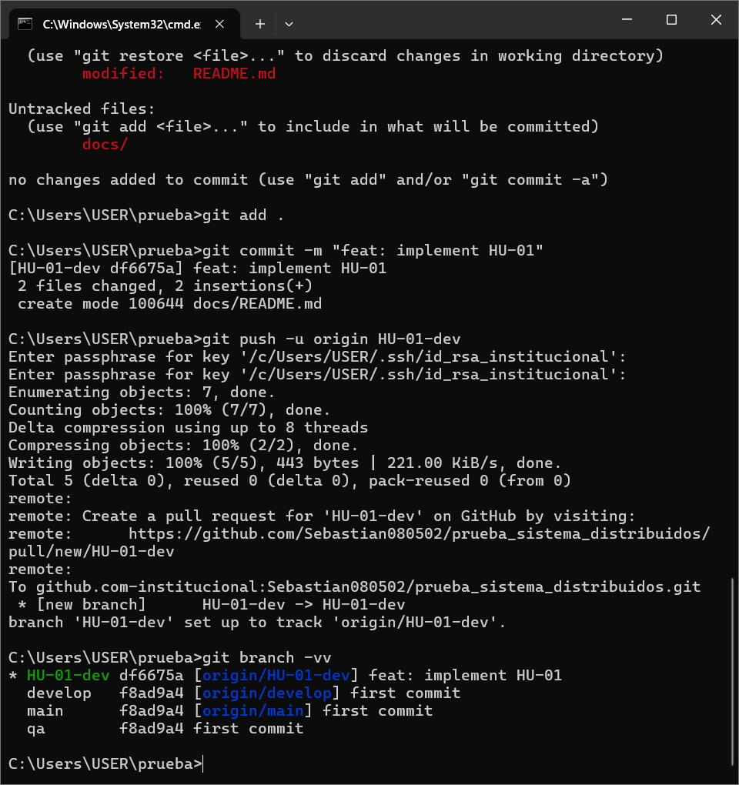

### 2. HU-01 on qa

Branch `HU-01-qa` was created. The validation commit `test:validate HU-01-qa` was pushed and integrated through [Pull Request #2](https://github.com/Sebastian080502/prueba_sistema_distribuidos/pull/2) into `qa`.

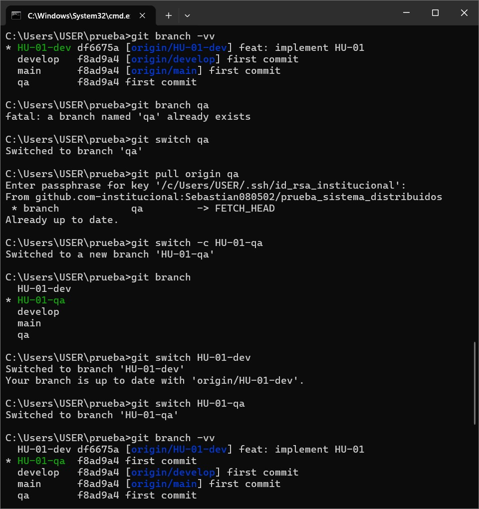

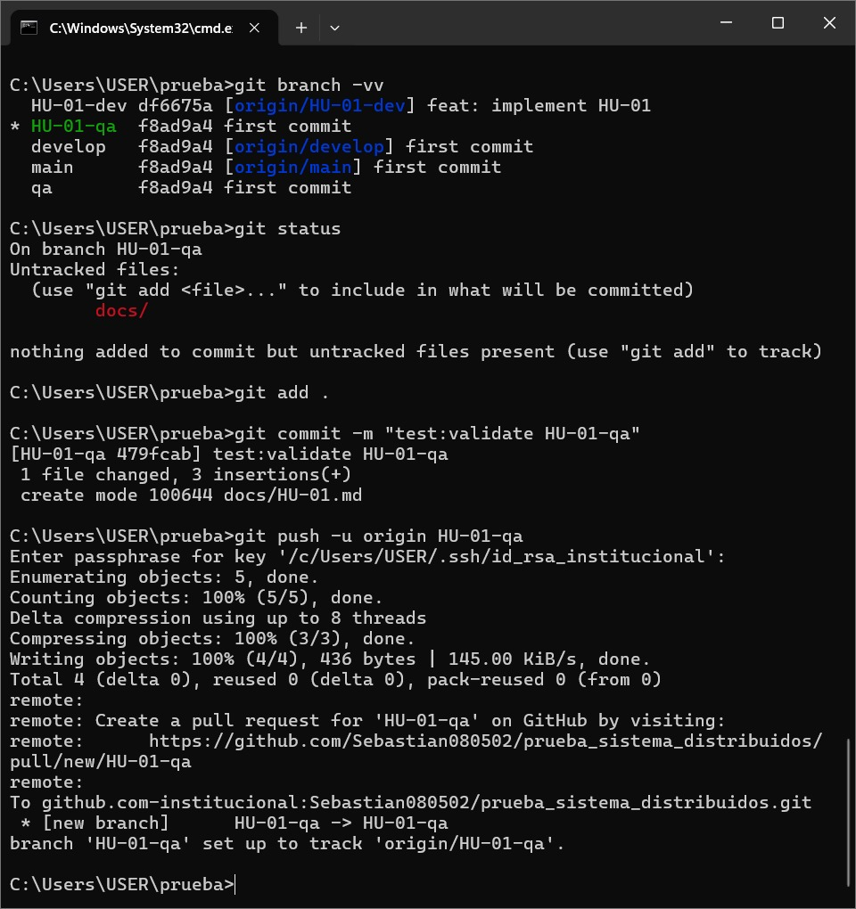

### 3. Release 1.0.0 on main

Branch `release/1.0.0` prepared the release with `release: prepare version 1.0.0` and [Pull Request #3](https://github.com/Sebastian080502/prueba_sistema_distribuidos/pull/3) into `main`.

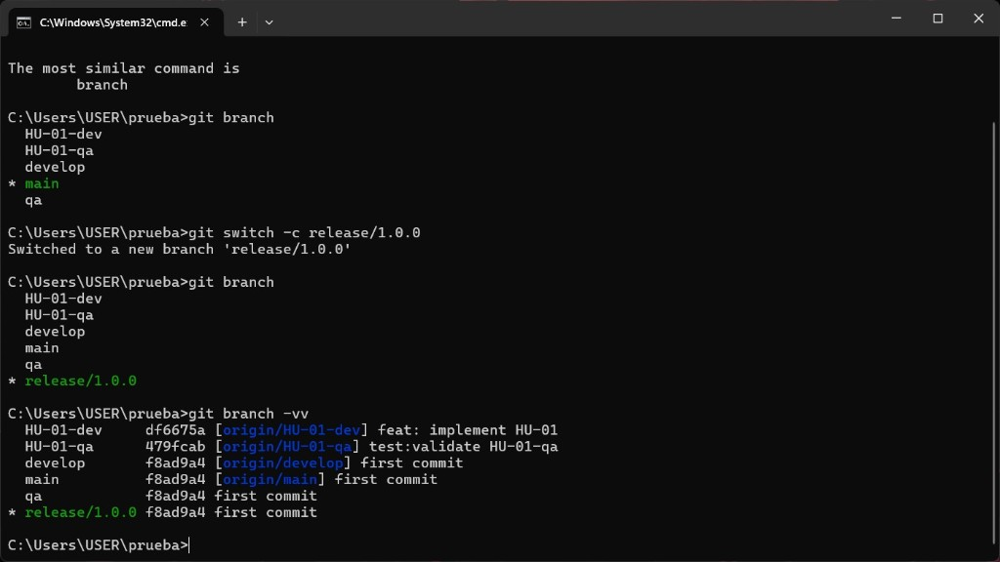

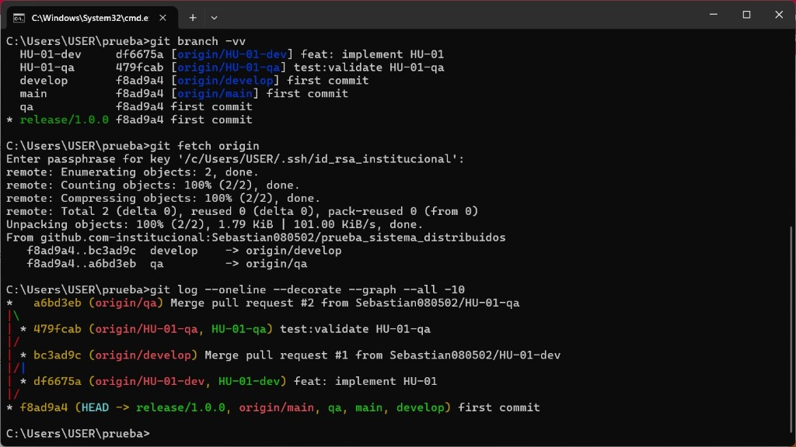

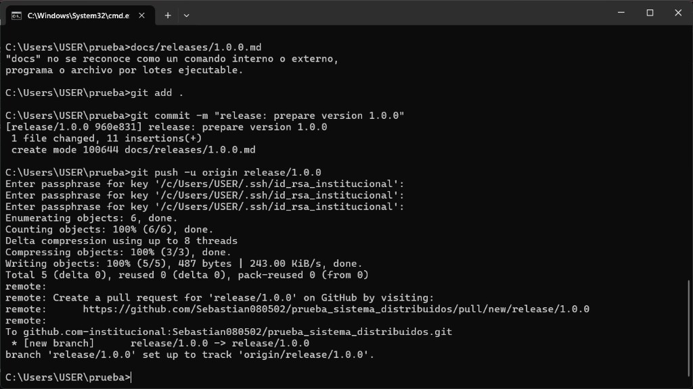

### 4. HU-02 from develop

HU-02 started from `develop` with `feat: implement HU-02` and [Pull Request #4](https://github.com/Sebastian080502/prueba_sistema_distribuidos/pull/4) into `develop`.

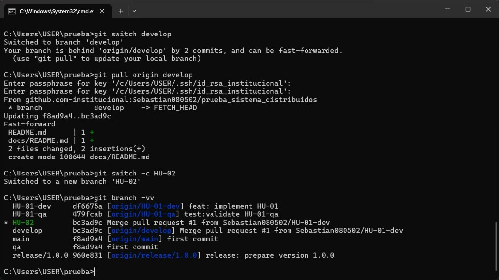

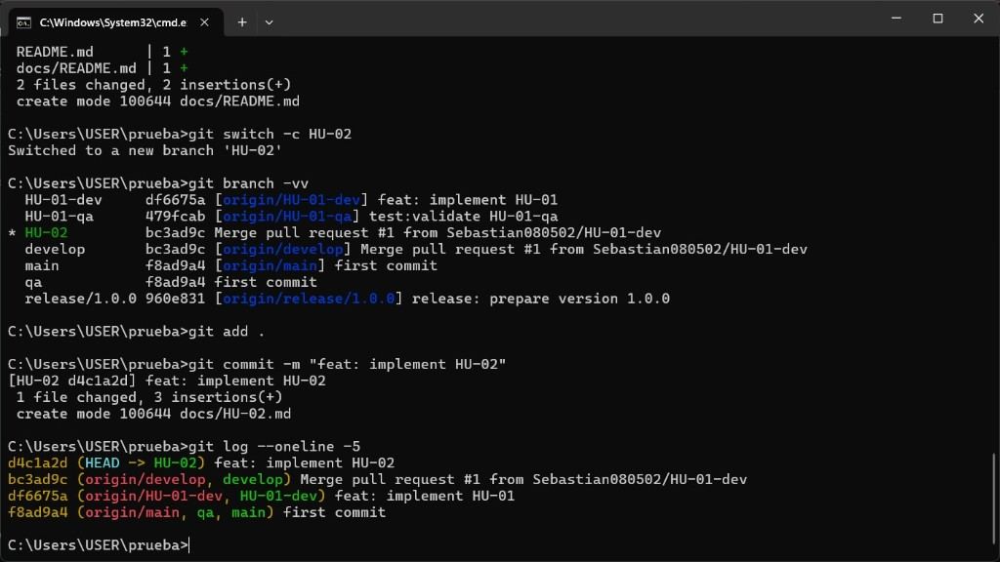

### 5. Cherry-pick HU-02 onto qa and main

Commit `d4c1a2d` was cherry-picked onto `qa`, then onto `main` (`62666b4` / `9f992fe`). Cherry-pick applied one specific commit without merging the whole source branch.

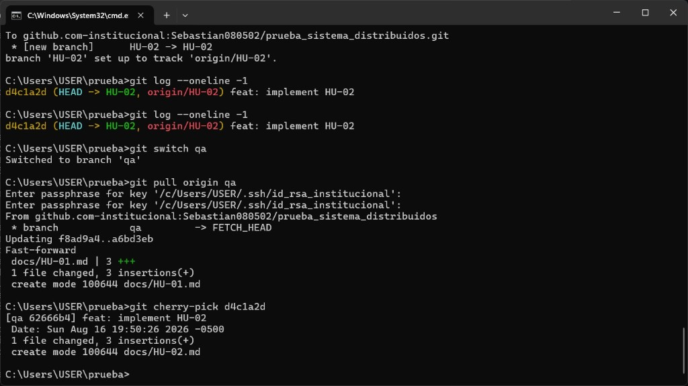

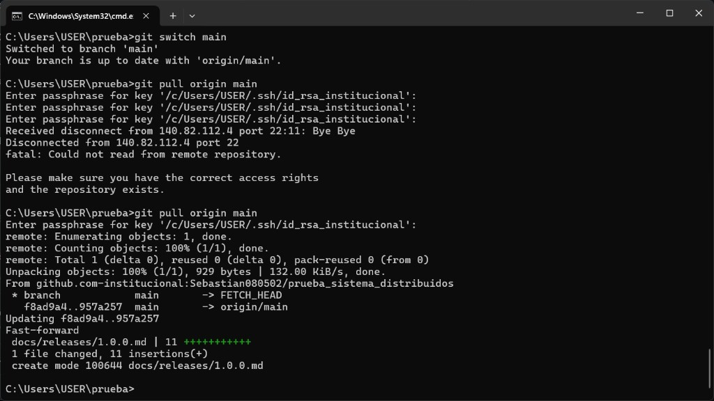

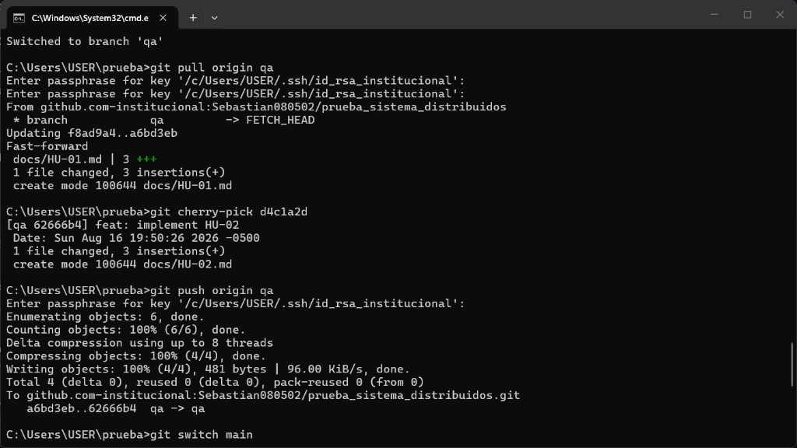

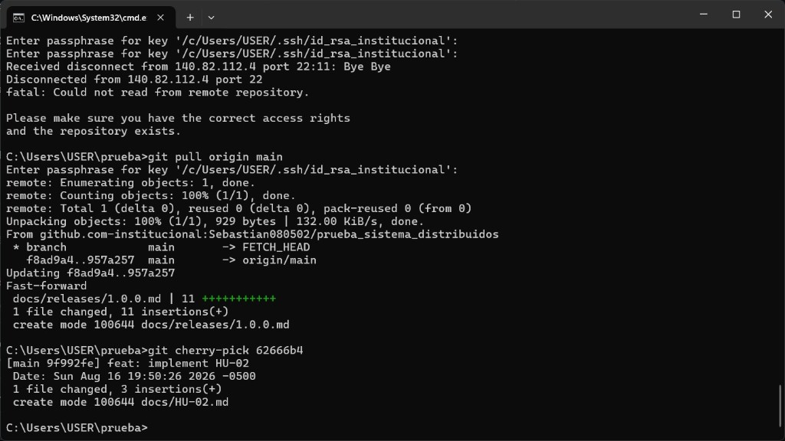

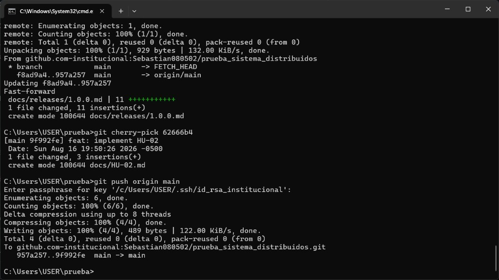

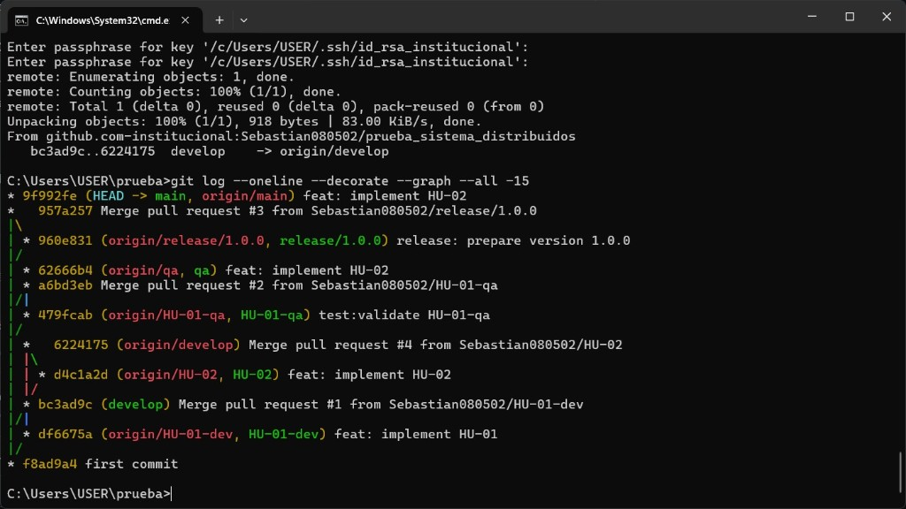

## Relationship with the project

The same flow will be used in the first Sprint of the Distributed Reservation Platform: product stories on `hu-xxx-dev`, Pull Request to `develop`, and controlled promotion to `qa` and `main`.
